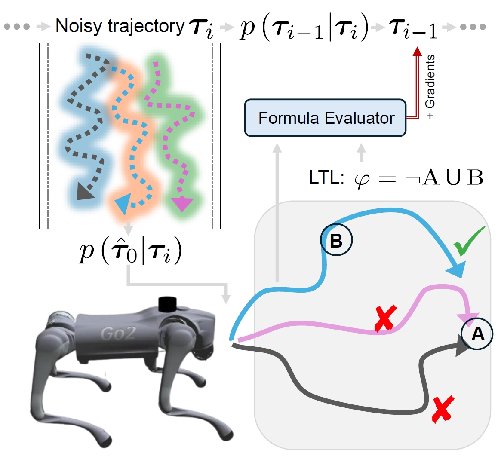

# LTLDoG: Satisfying Temporally-Extended Symbolic Constraints for Safe Diffusion-based Planning
[](https://arxiv.org/abs/2405.04235)
[](https://opensource.org/licenses/MIT)
[[Project page]](https://clear-nus.github.io/blog/ltldog)

[Zeyu Feng](https://scholar.google.com/citations?user=l-Ob1vAAAAAJ&hl=en)<sup>1</sup>,
[Hao Luan](https://edmundluan.github.io)<sup>1</sup>,
[Pranav Goyal](https://scholar.google.com/citations?user=4lQd0TsAAAAJ&hl=en&oi=sra)<sup>1</sup>,
[Harold Soh](https://haroldsoh.com/)<sup>1,2</sup>

<sup>1</sup>Department of Computer Science, School
of Computing, National University of Singapore,
<sup>2</sup>Smart Systems Institute, National University of Singapore

https://github.com/user-attachments/assets/b571f139-2462-49da-aabe-a0adebfd08b7

This repository contains the implementation of the diffusion-based planning method under $\textnormal{LTL}_f$ constraints proposed in the RA-L paper [LTLDoG: Satisfying Temporally-Extended Symbolic Constraints for Safe Diffusion-based Planning](https://ieeexplore.ieee.org/document/10637680).

If you find this repo or the ideas presented in our paper useful for your research, please consider citing our paper.
```
@article{10637680,
    title   = {{LTLDoG}: Satisfying Temporally-Extended Symbolic Constraints for Safe Diffusion-Based Planning},
    author  = {Feng, Zeyu and Luan, Hao and Goyal, Pranav and Soh, Harold},
    journal = {IEEE Robotics and Automation Letters},
    year    = {2024},
    volume  = {9},
    number  = {10},
    pages   = {8571-8578},
    doi     = {10.1109/LRA.2024.3443501},
}
```


## 📢 Introduction
Operating effectively in complex environments while complying with specified constraints is crucial for the safe and successful deployment of robots that interact with and operate around people. In this work, we focus on generating long-horizon trajectories that adhere to novel static and temporally-extended constraints/instructions at test time. We propose a data-driven diffusion-based framework, LTLDoG, that modifies the inference steps of the reverse process given an instruction specified using finite linear temporal logic ($\textnormal{LTL}_f$). LTLDoG leverages a satisfaction value function on $\textnormal{LTL}_f$ and guides the sampling steps using its gradient field. This value function can also be trained to generalize to new instructions not observed during training, enabling flexible test-time adaptability. Experiments in robot navigation and manipulation illustrate that the method is able to generate trajectories that satisfy formulae that specify obstacle avoidance and visitation sequences.

<p align="center">
  
</p>


## 🔨 Usage
For training and testing on `Maze2d` and `PushT` tasks, please see specific instructions in the folders [Maze2d](./maze2d) and [PushT](./pusht), respectively.

In order to download our augmented dataset of trajectories in `PushT` task, go to: [PushT_GoogleDrive](https://drive.google.com/file/d/1jRfJtiBL-cYcFbmQczzVGXK8THSp--en/view?usp=sharing).


## 📄 Appendix
This repository also contains the [appendix](./appendix/ltldog-appendix.pdf) of paper [LTLDoG](https://ieeexplore.ieee.org/document/10637680).


## 🏷️ License
This repository is released under the MIT license. See [LICENSE](LICENSE) for additional details.


## 🙏 Acknowledgement
* Our Maze2d implementation is based on [Diffuser](https://github.com/jannerm/diffuser). 
* Our PushT implementation is based on [Diffusion Policy](https://github.com/real-stanford/diffusion_policy).
* Our differentiable temporal logic evaluation is based on [DTL](https://github.com/ZiweiXU/DTL-action-segmentation).
